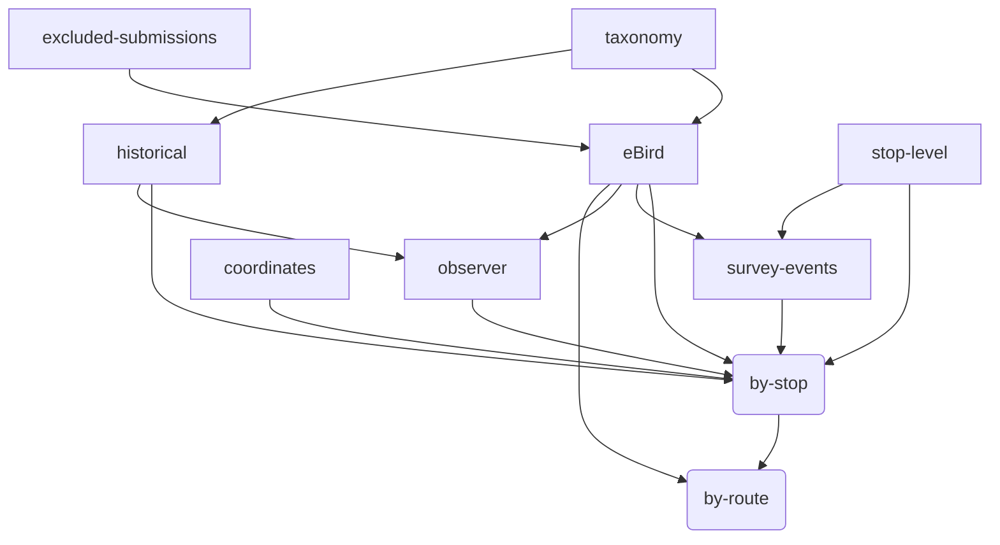

# MBBS data pipeline

This document describes:

* sources of MBBS data
* how each data from each source is transformed and cleaned
* how the data are combined into the final artifacts
* how the artifacts are versioned and made available to users
* conventions used in the `mbbs` package related to the above

## Key definitions

Route
: An MBBS survey route.
Each route has 20 stops.

Stop
: A location on a route where a surveyer counts birds for 3 minutes
according to the MBBS protocol.
Each stop is separated by approximately 0.5 miles.

## Data sources

MBBS data comes from several sources.
They are briefly here
and explained in more detail below.

`eBird`
: As as 2009, all MBBS checklists are submitted to [eBird](https://ebird.org).
These checklists are downloaded manually as CSV files.
Prior to 2022, checklists were submitted at the route-level.

`historical`
: Checklists scraped from the old MBBS site
or files provided by Haven Wiley.

`stop-level`
: For some routes prior to 2022,
participants have provided stop-level records.
When possible, this data is used to disaggregate route-level checklists.

`survey-events`
: complete listing of years/route/stop where an observation was made.

`taxonomy`
: The
[eBird taxonomy](https://support.ebird.org/en/support/solutions/articles/48000837816-the-ebird-taxonomy)
is used to normalize checklist species to a common taxonomy.
Taxonomy CSV files are manually downloaded and stored in
`inst/taxonomy/ebird_taxonomy_vXXXX.csv`.
The `get_latest_taxonomy` function is used internally for accessing the taxonomy.

`observer`
: End users will find data about which surveyors ran each route, and which observer is the 'primary_observer' in 'data/survey_events' which contains the: route, year, number of stops, and primary_observer - as well as other information about the observers. 
'data/survey_events' is updated every time the overall dataset is updated, at least once a year when the new data is downloaded.

'inst/survey_list'
This is the 'truth' record of all surveys, and contains information from ebird, scraped from the old website, and confirmed independently with surveyors about who ran which routes each year. It also summarized the number of species (S) and total birds seen (N). It is updated when new surveys have been added to ebird.

'main_observer_conversion_table'
This table contains a list of the expected observers for each route, used in calculating the primary_observer. It is updated when a route is surveyed by someone who hasn't run that route before. 

'mini_observer_conversion_table'
This table contains the conversions used to standardize observer names, eg 'Tom driscoll' and 'Tom Driscol' both become 'Tome Driscoll'

Processing of observers happens in 'R/process_observers'
The primary_observer is the highest quality observer who was part of the survey for a given route. 'observer_quality' is calculated as
N_species[route,year,observer(i)] - mean(N_species[route,!observer(i)]  / mean(N_species[route,!observer(i)] 
These comparison scores (one for every observer on every route-year) are then averaged for each observer to get their 'observer_quality'. A score of '.05' is interpretable as 'On average, this observer sees 5% more species than other surveyors on the same routes'.

`stop-coordinates`
: TODO Lat/Lon of the first stops for each route (right now)
'R/mbbs_routes'
Stable and not updated

`excluded-submissions`
: A file containing a list of eBird checklists
to exclude.

## Relations between sources and products

## Further details on data sources

See also:
[data-checklist.md](data-checklist.md)

### `eBird`

The `eBird` checklists are manually downloaded
as CSV files
from each of the mbbs ebird accounts:
`mbbsorangenc`,
`mbbsdurhamnc`,
and `mbbschathamnc`.
Files are stored in `inst/ebird/`.

### `historical`

Prior to 2009,
checklists were available on the old MBBS website.
These files were collated into single `csv` file for each county.
Files are stored in `inst/historical/`.
These data are not updated.

### `stop-level`

Prior to 2022, survey counts were aggregated at the route level.
This data is the un-summarized version of the routes for which records exist.
The `stop-level` data comes from a variety of sources,
and is all stored in
`inst/stop_level/`.
The data is considered stable and not updated.

The sources are as follows:

1. Excel files provided by observers.
The raw data are stored in `inst/stop-level/`
in folders by the name of the observer who sent them.
Code in `R/prepare_historical_xls`
creates the processed `stop_level_hist_xls.csv`.

2. Scraped from the `ebird` `species_comments` column.
Some checklists summarizing routes
on ebird contain stop-level information in the notes for each species.
The `R/process_species_comments` R script processes this data
into a stop-level format to create `stop_level_species_comments.csv`.

3. Transcribed paper files.
Many surveyors sent Haven Wiley their paper recording sheets
which were then summarized to route for the old website.
These sheets have been transcribed with double-entry to prevent errors.
The `transcribed_paper_files_NAME` spreadsheets
are processed to create `stop_level_transcribed_paper.csv`

NOTE:
When there is disagreement between counts
at the route-level and the stop-level,
such as cases where the route-level is higher by 1,
the stop-level data is .

## Data products

* "raw" data
* "analysis-ready" data
* Summarized by stop
* Summarized by route

### Versioning

Data products are versioned as follows...
