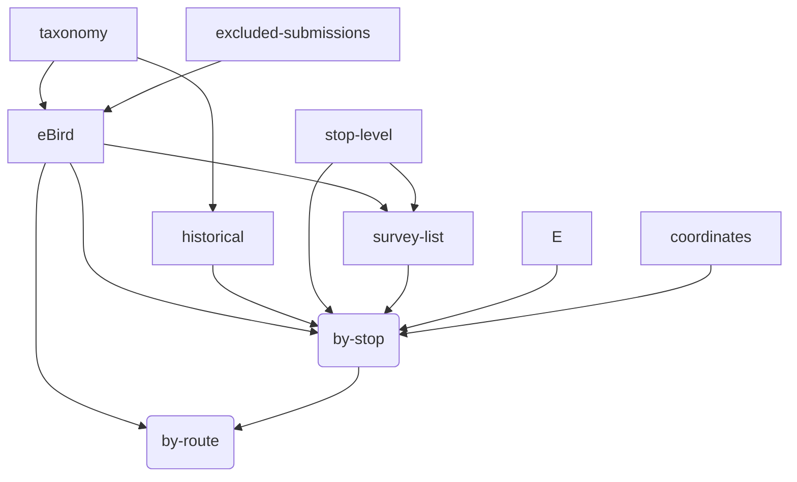

This document describes:

* sources of MBBS data
* how each data from each source is transformed and cleaned
* how the data are combined into the final artifacts
* how the artifacts are versioned and made available to users
* conventions used in the `mbbs` package related to the above

## Key definitions

Route
: An MBBS survey route.
Each route has 20 stops.

Stop
: A location on a route where a surveyer counts birds for 3 minutes
according to the MBBS protocol.
Each stop is separated by approximately 0.5 miles.

## Data sources

MBBS data comes from several sources.
They are briefly here
and explained in more detail below.

[`eBird`](#ebird) 

: As of 2009, all MBBS checklists are submitted to [eBird](https://ebird.org).
These checklists are downloaded manually as CSV files.
Prior to 2020, checklists were submitted at the route-level. Beginning in 2020, some users began submitting individual stop-level checklists, and by 2022 all (or nearly all?) checklists were stop-level eBird checklists.

[`historical`](#historical) 
: Checklists scraped from the old MBBS site
or files provided by Haven Wiley.

[`stop-level`](#stop-level) 
: For some routes prior to 2020,
participants have provided stop-level records (e.g. on personal paper data sheets or Excel files).
When available, we have used this data to disaggregate route-level checklists to the stop level.

[`survey-list`](#survey-list) 
: Complete listing of years/route where observations were made.

`taxonomy`
: The
[eBird taxonomy](https://support.ebird.org/en/support/solutions/articles/48000837816-the-ebird-taxonomy)
is used to normalize checklist species to a common taxonomy.
Taxonomy CSV files are manually downloaded and stored in
`data/taxonomy/ebird_taxonomy_vXXXX.csv`.
The `get_latest_taxonomy` function is used internally for accessing the taxonomy.

`route_stop_coordinates`
: Lat/Lon of the individual point count stops for each route,
as well as stop description notes 'R/mbbs_routes'.

`excluded-submissions`
: A file containing a list of eBird checklists to exclude.
Primarily these are checklists that are duplicated,
but in some cases
they may include pre-dawn (owling) checklists,
or checklists that were identified as problematic or unreliable for some reason.

`stop-deviations`
: A configuration file identifying stops where
(a) some deviation from the protocol occurred and/or
(b) the stop was visited but no birds were observed.
In the latter case,
eBird does not include an empty checklist,
so this is used to add back 0 counts for these stops.

## Relations between sources and products

## Further details on data sources

See also:
[data-checklist](data-checklist.html).

### `eBird`

The `eBird` checklists are manually downloaded
as CSV files
from each of the mbbs ebird accounts:
`mbbsorangenc`,
`mbbsdurhamnc`,
and `mbbschathamnc`.
Files are stored in `data/ebird/`.

Sometimes stop-level data are missing when in fact the route was surveyed
and stop-level data were collected for the rest of the route.
The `stop_deviations.yml` file tracks these deviations.
Deviations could be for 2 reasons:

1. The observer(s) were unable to access the stop(s)
   for safety or other reasons.
   In this case, we do not know the bird count,
   and no data for these stop are available.
2. The stop(s) were in fact observed,
   but no birds were seen.
   In this case, there is an eBird submission,
   but the eBird export does not include the empty checklists.
   In this case, we do know the count of all species is 0,
   and we add observations of 0 counts for these stops.

### `historical`

Prior to 2009,
checklists were available on the old MBBS website.
These files were collated into single `csv` file for each county.
Files are stored in `data/historical/`.
These data are not updated.

### `stop-level`

Prior to 2022 (prior to 2020 for some routes),
survey counts were aggregated at the route level.
This data is the un-summarized version of the routes for which records exist.
The `stop-level` data comes from a variety of sources,
and is all stored in
`data/stop_level/`.
The data is considered stable and not updated.

The sources are as follows:

1. Excel files provided by observers.
The raw data are stored in `data/stop-level/`
in folders by the name of the observer who sent them.
Code in `R/prepare_historical_xls`
creates the processed `stop_level_hist_xls.csv`.

2. Scraped from the `ebird` `species_comments` column.
Some checklists summarizing routes
on ebird contain stop-level information in the notes for each species by
listing comma-separated values of abundance
at each stop like ",,3,,1,,,1,1,,,,,,,1,2,,,1,".
The `R/process_species_comments` R script processes this data
into a stop-level format to create `stop_level_species_comments.csv`.

3. Transcribed paper files.
Many surveyors sent Haven Wiley their paper recording sheets
which were then summarized to route for the old website.
These sheets have been transcribed with double-entry to prevent errors.
The `transcribed_paper_files_NAME` spreadsheets
are processed to create `stop_level_transcribed_paper.csv`

NOTE:
When there is disagreement between counts
at the route-level and the stop-level,
the stop-level data is taken as the source of truth.

### `survey-list`

The `data/survey-list.csv` file contains a basic summary of all
route/years for which a survey was completed.
This data is taken from ebird, scraped from the old website,
and/or confirmed independently
with surveyors about who ran which routes each year.
It also summarizes the number of species (S) and total birds seen (N).
It is updated when new surveys have been added to ebird.

A normalized version of this file is availble as a [data product](#data-products).

## Data products

The following data are available from the
[MBBS data website](https://nc-minibbs.github.io/mbbs/).

* `mbbs_stops_counts.csv`:
Species counts by route/stop/year
*for route/years that we have available data*.
  * `year`: year of survey
  * `county`: chatham | durham | orange
  * `route`: survey route
  * `route_num`: route number within a county
  * `stop_num`: stop number within a route (1 - 20)
  * `source`:
    One of `ebird`, `obs_details`, `transcribed_paper`, or `observer_xls`.
    In the case that data are available
    from [multiple sources](#stop-level),
    the following preference is used:
    (1) `ebird`,
    (2) `obs_details`,
    (3) `transcribed_paper`,
    (4) `observer_xls`.
    See [`stop-level` description](#stop-level)
    for details on each of these sources.
  * `common_name`: scientific name from eBird taxonomy
  * `sci_name`: scientific name from eBird taxonomy
  * `count`: count of birds observed
* `mbbs_route_counts.csv`:
Species routes by route/year
for all route/years.
This dataset both summarizes `mbbs_stops_counts.csv` at the route level
and additionally includes route/years where we do not have stop level
counts available.
  * `year`: year of survey
  * `county`: chatham | durham | orange
  * `route`: survey route
  * `route_num`: route number within a county
  * `nstops`: number of stops that were surveyed on this route
  * `source`:
    One of `historical`, `stop-level`, or `ebird`,
    meaning the data came from [`historical`](#historical) sources,
    summarized from `stop-level`,
    or directly from `ebird`,
    respectively.
  * `common_name`: scientific name from eBird taxonomy
  * `sci_name`: scientific name from eBird taxonomy
  * `count`: count of birds observed
* `surveys.csv`:
Summary of all surveys run.
  * `route`: survey route
  * `year`: year of survey
  * `obs1`: name of first observer
  * `obs2`: name of second observer
  * `obs3`: name of third observers
  * `total_species`: total number of species observed
  * `total_abundance`: total number of birds observed
  * `date`:
    date of survey.
    In the case that survey was conducted on more than 1 date,
    the most common date is used.
  * `protocol_violation`:
    A boolean flag that the survey had any protocol violations,
    which may include:
    * survey conducted on more than 1 day
    * survey not conducted during study window (May 15 - June 30)
    * fewer than 20 stops were surveyed
* `comments.csv`:
*Caveat emptor*
This is essentially all the comments from ebird submissions.
It does includes `vehicles` and `weather` fields,
which are parsed from the `comments` field.
* `route_stop_coordinates.csv`:
Geographic coordinates of each stop.
  * `county`
  * `route`
  * `route_num`
  * `stop_num`
  * `lat`
  * `lon`
  * `stop_notes`
* `log.txt`: output of the data processing log

### Versioning

Data products are versioned as follows...
TODO
