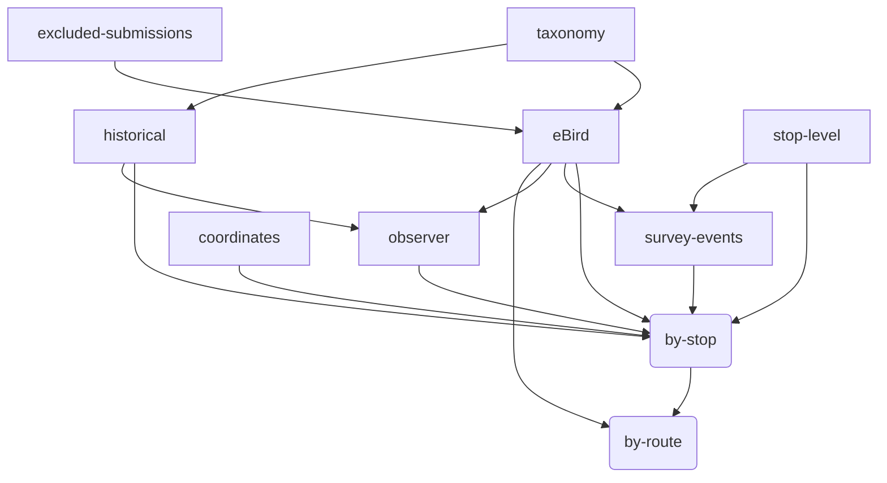

# MBBS data pipeline

This document describes:

* sources of MBBS data
* how each data from each source is transformed and cleaned
* how the data are combined into the final artifacts
* how the artifacts are versioned and made available to users
* conventions used in the `mbbs` package related to the above

## Key definitions

Route
: An MBBS survey route.
Each route has 20 stops.

Stop
: A location on a route where a surveyer counts birds for 3 minutes
according to the MBBS protocol.
Each stop is separated by approximately 0.5 miles.

## Data sources

MBBS data comes from several sources.
They are briefly here
and explained in more detail below.

`eBird`
: As as 2009, all MBBS checklists are submitted to [eBird](https://ebird.org).
These checklists are downloaded manually as CSV files.
Prior to 2022, checklists were submitted at the route-level.

`historical`
: Checklists scraped from the old MBBS site
or files provided by Haven Wiley.

`stop-level`
: For some routes prior to 2022,
participants have provided stop-level records.
When possible, this data is used to disaggregate route-level checklists.

`survey-events`
: complete listing of years/route/stop where an observation was made.

`taxonomy`
: The
[eBird taxonomy](https://support.ebird.org/en/support/solutions/articles/48000837816-the-ebird-taxonomy)
is used to normalize checklist species to a common taxonomy.
Taxonomy CSV files are manually downloaded and stored in
`inst/taxonomy/ebird_taxonomy_vXXXX.csv`.
The `get_latest_taxonomy` function is used internally for accessing the taxonomy.

`observer`
: TODO

`stop-coordinates`
: TODO Lat/Lon of stops

`excluded-submissions`
: A file containing a list of eBird checklists
to exclude.

## Relations between sources and products

## Further details on data sources

See also:
[data-checklist.md](data-checklist.md)

### `eBird`

The `eBird` checklists are manually downloaded
as CSV files
from each of the mbbs ebird accounts:
`mbbsorangenc`,
`mbbsdurhamnc`,
and `mbbschathamnc`.
Files are stored in `inst/extdata/ebird/`.

### `historical`

TODO

### `stop-level`

TODO

## Data products

* "raw" data
* "analysis-ready" data
* Summarized by stop
* Summarized by route

### Versioning

Data products are versioned as follows...
