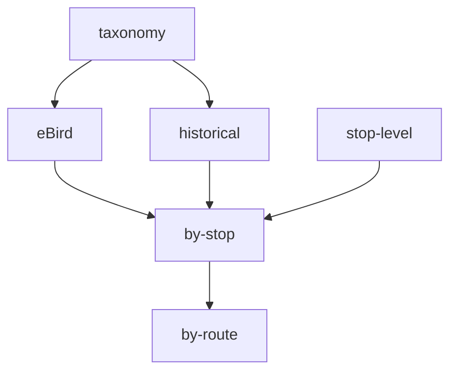

# MBBS data pipeline

This document describes:

* sources of MBBS data
* how each data from each source is transformed and cleaned
* how the data are combined into the final artifacts
* how the artifacts are versioned and made available to users
* conventions used in the `mbbs` package related to the above

## Data sources

MBBS data comes from several sources:

1. [ebird checklists](https://ebird.org):
2. ebird taxonomy
3. stop level data (TODO)
4. Pre-2009 checklists provided by Haven Wiley

## Data products

1. Summarized by stop
2. Summarized by route
